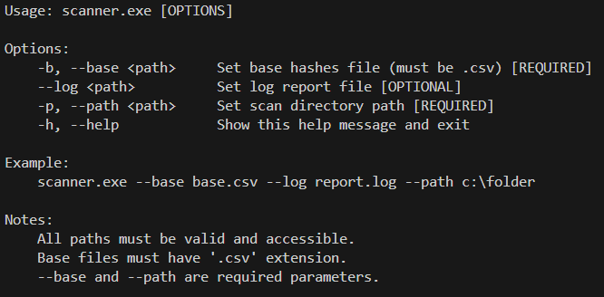
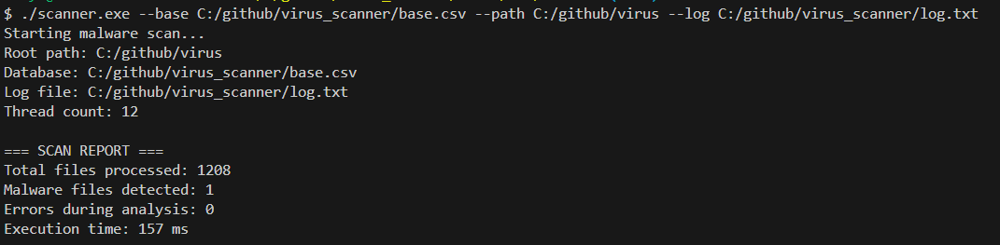
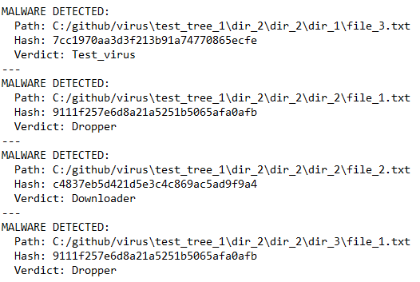

# VirusScanner

Утилита для сканирования директории и обнаружения «вредоносных» файлов по их MD5-хешам.
Проект написан на **C++ (C++17/C++20)**, использует **CMake**, основная логика вынесена в **DLL (scanner)**, CLI — в отдельном исполняемом файле, есть тесты на **GoogleTest**.

---

## Кратко — что делает утилита

* Рекурсивно обходит указанную корневую директорию.
* Для каждого файла вычисляет MD5 хеш.
* Сравнивает хеш с базой вредоносных хешей (CSV).
* Логирует найденные угрозы в текстовый лог (путь передаётся в аргументах).
* По завершении выводит отчёт.

---

## Структура репозитория

```
/scanner          — библиотека (DLL) с основной логикой
/scannerCli       — консольная утилита
/tests            — тесты
```

## Формат базы хешей (CSV)

Каждая строка — `md5;verdict` (разделитель `;`).

Пример:

```
a9963513d093ffb2bc7ceb9807771ad4;Exploit
ac6204ffeb36d2320e52f1d551cfa370;Dropper
8ee70903f43b227eeb971262268af5a8;Downloader
```

## CLI: использование



## Вывод в консоль (пример)



Если найдены угрозы, они записываются в лог:



## Требования / зависимости

* **CMake**
* **C++17** (проект настроен на C++17, можно поднять до C++20)
* **OpenSSL** (для MD5)
* **gtest**

## Рекомендованная установка зависимостей (vcpkg)

### Установка vcpkg (оба варианта — Windows / Unix-подобные)

```bash
# Клонируем и собираем vcpkg
git clone https://github.com/microsoft/vcpkg.git
cd vcpkg
# Windows: bootstrap-vcpkg.bat
# Linux/macOS: ./bootstrap-vcpkg.sh
./bootstrap-vcpkg.sh
./vcpkg integrate install
```

### Установка пакетов через vcpkg

```bash
./vcpkg install openssl
./vcpkg install gtest
```

### Использование vcpkg с CMake

Перед запуском `cmake` указывайте toolchain-файл:

```bash
cmake -S . -B build -DCMAKE_TOOLCHAIN_FILE=/path/to/vcpkg/scripts/buildsystems/vcpkg.cmake
cmake --build build --config Release
```
---

## Сборка проекта

### Linux / macOS

```bash
git clone https://github.com/bk-ru/virus_scanner.git
cd virus_scanner
cmake -S . -B build -DCMAKE_TOOLCHAIN_FILE=/path/to/vcpkg/scripts/buildsystems/vcpkg.cmake
cmake --build build --config Release -j$(nproc)
```

### Windows (Visual Studio)

```powershell
git clone https://github.com/bk-ru/virus_scanner.git
cd virus_scanner
cmake -S . -B build -G "Visual Studio 17 2022" -A x64 -DCMAKE_TOOLCHAIN_FILE=C:/vcpkg/scripts/buildsystems/vcpkg.cmake
cmake --build build --config Release
```

После сборки исполняемые файлы и библиотеки попадут в:

* **Windows:** `build/bin/`
* **Linux/macOS:** `build/`

---

## Запуск тестов

Проект использует GoogleTest и `gtest_discover_tests`.

Запуск всех тестов:

```bash
cd build
ctest -C Release -V
```